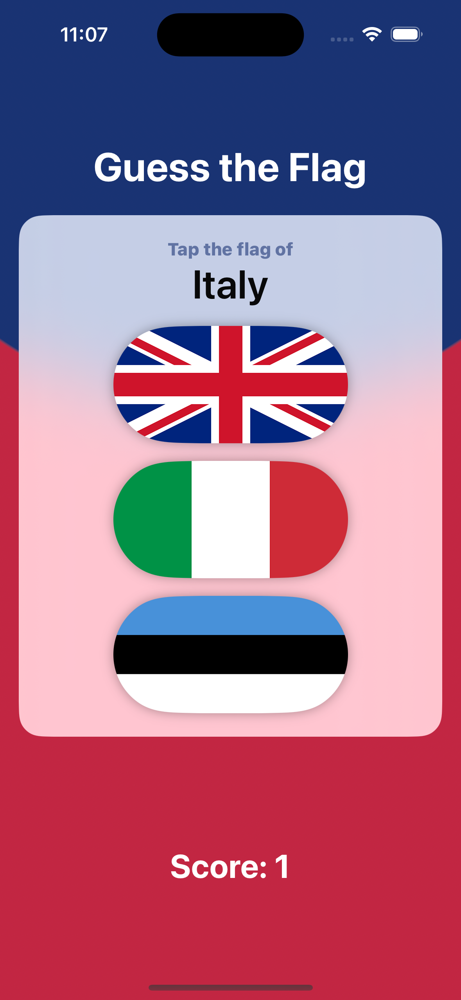
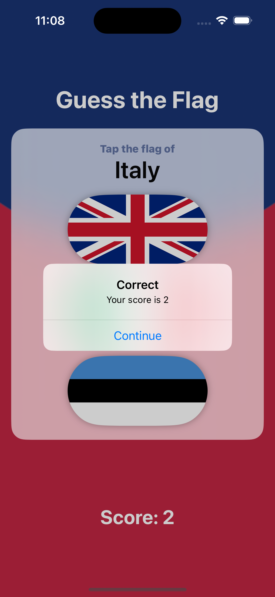
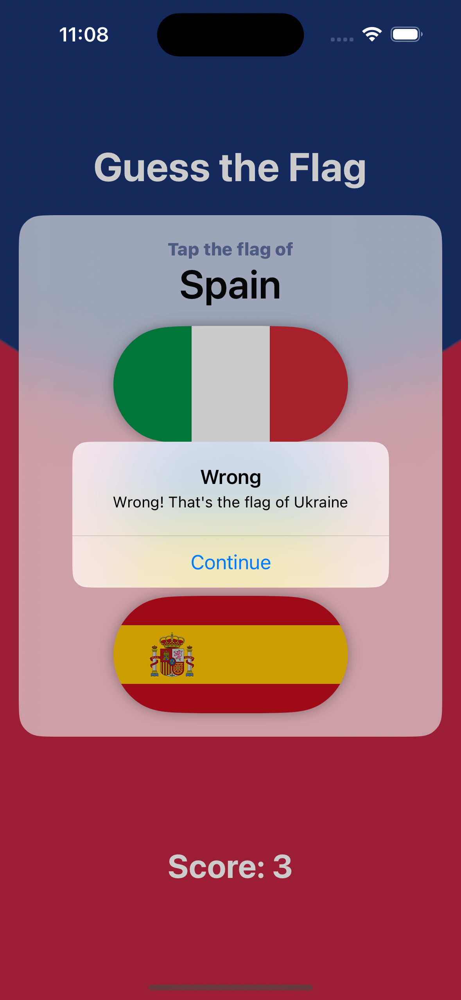

# Guess The Flag

Guess The Flag is a simple iOS game built using SwiftUI where players are presented with three flags of different countries and have to guess the correct one based on the country name provided. The game tracks the player's score and presents feedback for each guess.

    
    
    

## Features

- **Flag Guessing**: Players are presented with three flags and must tap the correct one based on the country name displayed.
- **Scoring System**: The game keeps track of the player's score, incrementing it for correct guesses.
- **Feedback**: After each guess, players receive feedback indicating whether their guess was correct or not.

## How to Play

1. Launch the app.
2. Observe the country name displayed at the top.
3. Tap the flag that corresponds to the displayed country.
4. Receive feedback on whether your guess was correct or not.

## Technologies Used

- **SwiftUI**: Used for building the user interface of the game.
- **Swift**: The programming language used to implement the game logic.
- **Xcode**: The integrated development environment used for iOS app development.

## Getting Started

To run this project locally, you'll need:

- Xcode installed on your Mac.
- Clone this repository to your local machine.
- Open the project in Xcode.
- Build and run the project on a simulator or your iOS device.

## Credits

This project is part of the ["100 Days of SwiftUI" course](https://www.hackingwithswift.com/100/swiftui) by Paul Hudson. I learned how to build this game and further develop my SwiftUI skills through the course.

## Learning Experience

In addition to following the main project instructions, I completed extra challenges provided at the end of the course where there were no instructions.
